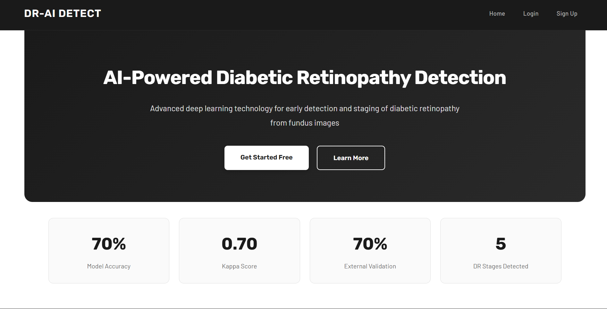
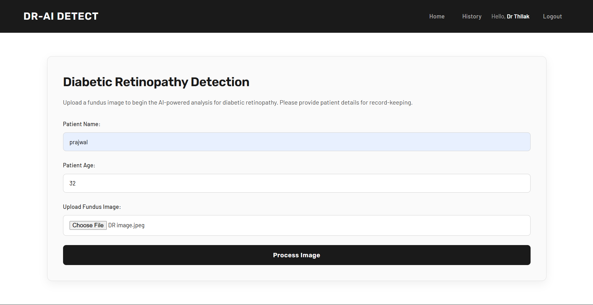
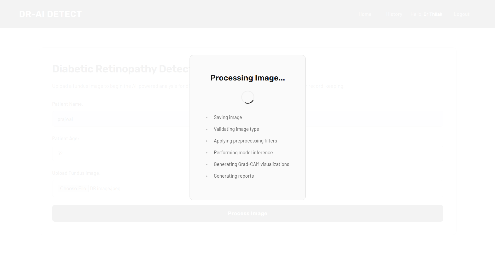

<div align="center">

# DR-AI DETECT: Ensembling xAI towards Diabetic Retinopathy Detection

[](https://opensource.org/licenses/Apache-2.0)
[](https://www.python.org/)
[](https://flask.palletsprojects.com/)
[](https://www.mongodb.com/)


<p>
An advanced AI-powered system for early detection and staging of diabetic retinopathy using ensemble deep learning models with explainable AI (xAI) visualizations.
</p>


</div>

---

## 📋 Quick Navigation

| Core Sections | Technical Details | Additional Resources | Legal & Contact |
|:---:|:---:|:---:|:---:|
| [🔵 Overview](#-overview) | [🛠️ Technology Stack](#️-technology-stack) | [🔬 Explainable AI](#-explainable-ai) | [📄 License](#-license) |
| [✨ Key Features](#-key-features) | [🚀 Installation](#-installation) | [📸 Screenshots](#-screenshots) | [⚠️ Disclaimer](#️-disclaimer) |
| [🏗️ System Architecture](#️-system-architecture) | [💻 Usage](#-usage) | [📁 Project Structure](#-project-structure) | [📚 Citation](#-citation) |
| [📊 Model Performance](#-model-performance) | [🧠 Model Details](#-model-details) | [🤝 Contributing](#-contributing) | [📧 Contact](#-contact) |

---

## 🔍 Overview

Diabetic Retinopathy (DR) is a leading cause of blindness worldwide. **DR-AI DETECT** leverages state-of-the-art deep learning to analyze fundus images and provide accurate staging of diabetic retinopathy. The system employs an ensemble approach combining multiple CNN architectures (ResNet18, DenseNet121, EfficientNet-B0, and ResNext50) with Grad-CAM visualizations for model interpretability.

### Why Ensemble Learning?

- **Higher accuracy** through majority voting
- **Reduced overfitting** by model diversity
- **Improved generalization** across various retinal image characteristics

---

## ✨ Key Features

### Clinical Intelligence
- **Multi-stage DR Detection**: Classifies retinal images into 5 stages (0-4)
- **Ensemble Prediction**: Combines predictions from 4 CNN architectures
- **High Accuracy**: 70% model accuracy with 0.70 Kappa score
- **External Validation**: 70% validation accuracy

### Explainable AI
- **Grad-CAM Visualizations**: Highlights regions influencing predictions
- **Multi-model Heatmaps**: Interpretability across all ensemble members
- **Clinical Trust**: Enables ophthalmologists to verify AI reasoning

### Technical Capabilities
- **Automated Preprocessing**: CLAHE enhancement and filtering
- **AI-powered Validation**: Gemini API for image quality assessment
- **Secure Database**: MongoDB for patient records and history
- **User Authentication**: Secure login and session management

---

## 🏗️ System Architecture

```
Frontend (HTML/CSS/JS) → Flask Backend → Ensemble Models → MongoDB
                              ↓
                    Gemini API Validation
                              ↓
                    Preprocessing Pipeline
                              ↓
            ┌────────────────┴────────────────┐
            ↓         ↓         ↓             ↓
        ResNet18  DenseNet  EfficientNet  ResNext50
            └────────────────┬────────────────┘
                             ↓
                    Majority Voting
                             ↓
                    Grad-CAM Generation
                             ↓
                    Report Generation (Gemini)
```

---

## 📊 Model Performance

| Metric | Value |
|--------|-------|
| **Model Accuracy** | 70% |
| **Kappa Score** | 0.70 |
| **External Validation** | 70% |
| **DR Stages Detected** | 5 (Stages 0-4) |

### DR Stage Classification

- **Stage 0**: No Diabetic Retinopathy
- **Stage 1**: Mild Non-Proliferative DR
- **Stage 2**: Moderate Non-Proliferative DR
- **Stage 3**: Severe Non-Proliferative DR
- **Stage 4**: Proliferative DR (PDR)

---

## 🛠️ Technology Stack

### Deep Learning & AI
- **PyTorch**: Neural network inference
- **OpenCV**: Image preprocessing
- **NumPy**: Data processing
- **Google Gemini API**: Image validation and report generation

### Backend
- **Flask**: Web framework
- **Python 3.8+**: Core language
- **MongoDB**: Patient records database
- **PyMongo**: MongoDB driver

### Model Architectures
- **ResNet18**: Residual learning
- **DenseNet121**: Dense connectivity
- **EfficientNet-B0**: Efficient scaling
- **ResNext50_32x4d**: Aggregated residual transformations

---

## 🚀 Installation

### Prerequisites

```bash
Python 3.8+
MongoDB 5.0+
Git
```

### Setup

```bash
# Clone repository
git clone https://github.com/thilak-r/Ensembling-xAI-towrads-Diabetic-Retionopathy.git
cd Ensembling-xAI-towrads-Diabetic-Retionopathy

# Create virtual environment
python -m venv venv
source venv/bin/activate  # Linux/Mac
# OR
venv\Scripts\activate  # Windows

# Install dependencies
pip install -r requirements.txt

# Configure environment variables
# Create .env file with:
# FLASK_SECRET_KEY=your-secret-key
# MONGODB_URI=mongodb://localhost:27017/
# GEMINI_API_KEY=your-gemini-api-key

# Start MongoDB
# Linux: sudo systemctl start mongod
# Mac: brew services start mongodb-community
# Windows: net start MongoDB

# Run application
python app.py
```

Access at `http://localhost:5000`

---

## 💻 Usage

### 1. Create Account & Login
Register with username and password, then login to access the system.

### 2. Upload Fundus Image
Navigate to upload page and select a retinal fundus image (JPEG/PNG).

### 3. Enter Patient Details
Provide patient name and age for record-keeping.

### 4. Process Image
The system will:
- Validate image using Gemini AI
- Apply preprocessing (filtering + CLAHE)
- Run ensemble model inference
- Generate Grad-CAM visualizations
- Create comprehensive report

### 5. View Results
- **Preprocessing Steps**: Original, Filtered, CLAHE-enhanced images
- **Model Predictions**: Individual model results with confidence scores
- **Grad-CAM Heatmaps**: Explainable AI visualizations
- **Clinical Report**: AI-generated analysis summary

### 6. Access History
View past analyses and patient records through the History page.

---

## 🧠 Model Details

### Ensemble Architecture

Our system combines four CNN architectures using majority voting:

**ResNet18**: 18 layers with skip connections for gradient flow  
**DenseNet121**: 121 layers with dense feature propagation  
**EfficientNet-B0**: Optimized efficiency through compound scaling  
**ResNext50_32x4d**: Cardinality-based feature aggregation

### Training Configuration

- **Dataset**: Kaggle Diabetic Retinopathy Detection
- **Split**: 70% train, 15% validation, 15% test
- **Augmentation**: Rotation, flipping, zoom, brightness
- **Optimizer**: Adam with learning rate scheduling
- **Loss**: Categorical cross-entropy

---

## 🔬 Explainable AI

### Grad-CAM Visualizations

Gradient-weighted Class Activation Mapping highlights important image regions:

- **Red/Orange**: High importance (potential pathology)
- **Blue/Purple**: Low importance (healthy tissue)
- **Model Consensus**: All models highlight same regions = high confidence
- **Model Disagreement**: Different regions = requires clinical review

### Clinical Value

- Identifies hemorrhages, microaneurysms, exudates
- Enables clinicians to verify AI reasoning
- Builds trust in automated diagnosis

---

## 📸 Screenshots

### Landing Page


### Upload Interface


### Processing Pipeline


### Grad-CAM Results


### Analysis Report



---

## 📁 Project Structure

```
Ensembling-xAI-towrads-Diabetic-Retionopathy/
│
├── app.py                      # Main Flask application
├── database.py                 # MongoDB operations
├── requirements.txt            # Dependencies
├── README.md                   # Documentation
│
├── models/                     # Pre-trained weights
│   ├── resnet18_model.h5
│   ├── densenet121_model.h5
│   ├── efficientnet_b0_model.h5
│   └── resnext50_model.h5
│
├── utils/                      # Utility functions
│   ├── preprocessing.py        # Image preprocessing
│   ├── models.py              # Model inference
│   ├── gradcam.py             # Grad-CAM generation
│   └── gemini_utils.py        # Gemini API integration
│
├── static/                     # Static assets
│   ├── css/
│   ├── js/
│   └── uploaded_images/
│
├── templates/                  # HTML templates
│   ├── landing.html
│   ├── index.html
│   ├── results.html
│   └── history.html
│
└── assets/                     # Documentation images
```

---

## 🤝 Contributing

Contributions are welcome! Areas for improvement:

- Implement Vision Transformers
- Mobile application development
- Batch processing capabilities
- Multi-language support

**Workflow:**
1. Fork the repository
2. Create feature branch (`git checkout -b feature/NewFeature`)
3. Commit changes (`git commit -m 'Add NewFeature'`)
4. Push to branch (`git push origin feature/NewFeature`)
5. Open Pull Request

---

## 📄 License

Licensed under **Apache License 2.0** - see [LICENSE](LICENSE) file.

```
Copyright 2025 Thilak R

Licensed under the Apache License, Version 2.0
```

---

## ⚠️ Disclaimer

**FOR RESEARCH AND EDUCATIONAL PURPOSES ONLY**

This software is NOT intended for clinical diagnosis. All predictions must be verified by qualified ophthalmologists. Not FDA/CE approved.

---

## 📚 Citation

```bibtex
@software{draidetect2025,
  author = {Thilak R},
  title = {DR-AI DETECT: Ensembling xAI towards Diabetic Retinopathy Detection},
  year = {2025},
  publisher = {GitHub},
  url = {https://github.com/thilak-r/Ensembling-xAI-towrads-Diabetic-Retionopathy}
}
```

---

## 📧 Contact

**Thilak R**  
GitHub: [@thilak-r](https://github.com/thilak-r)  
Project: [DR-AI DETECT](https://github.com/thilak-r/Ensembling-xAI-towrads-Diabetic-Retionopathy)

---
## References
Dataset : [APTOS dataset](https://www.kaggle.com/datasets/sovitrath/diabetic-retinopathy-224x224-gaussian-filtered)
---
<div align="center">

### ⭐ Star this repository if you find it helpful!

**Made with ❤️ for better healthcare through AI**

© 2025 DR-AI Detect Project. All Rights Reserved.

</div>
## Keywords (SEO)
Diabetic Retinopathy, Deep Learning, Ensemble Learning, Explainable AI, Grad-CAM, Medical Imaging, Retinal Fundus Images, Disease Classification, Healthcare AI, Computer Vision, CNN, PyTorch.
